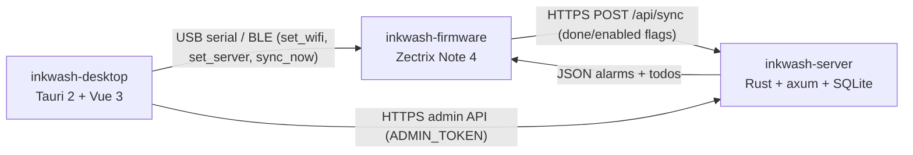

# Inkwash — e-ink calendar, alarms & todos for the Zectrix Note 4

A complete **offline-first calendar / alarm / todo experience** built for the
[**Zectrix Note 4**](https://zectrix.com) — the 4.2″ 400×300 e-paper
ESP32-S3 notebook. Firmware written in Rust (esp-idf), with a companion
server and PC tool in sibling repos.

[](LICENSE)
[](docs/development-guide.md)
[-orange.svg)](rust-firmware/rust-toolchain.toml)


## What it is

A real, usable e-ink device firmware — not a button-counter demo. It is
**offline-first**: alarms are stored on the device and rung by the RTC
hardware alarm, so a fully-charged, no-network Note 4 still wakes you up
on time. Content (alarms, todos) lives on the server and is pulled as
structured JSON over Wi-Fi — the device is not an image-serving thin client.

- **Home** — big clock, next-alarm summary with countdown, open-todo stats.
- **Calendar** — month grid with todo-due dots; pick a day and ENTER opens
  a per-week view listing exactly what is due that day.
- **Alarms** — daily / weekly (days of week) / monthly (days of month) /
  one-shot schedules, rung offline by the PCF8563 hardware alarm.
- **Todos** — importance (low/med/high), due dates, repeat schedules,
  one-shot reminders for high-priority items.
- **Inbox** — notifications pushed from external sources (webhooks, agents,
  CI) via the server; browse, open, mark read. An unread badge shows on the
  home screen, and `alert`-kind items ring a full-screen reminder.
- **Config** — Wi-Fi / server / timezone pushed over USB serial or BLE by
  the desktop tool; no on-device text input.

  

## Architecture

Three sibling repositories make up the system. The device never authors
content; the PC tool only pushes configuration, and the device pulls
content from the server.



- **this repo (`inkwash-firmware`)** — the Note 4 firmware (Rust, esp-idf).
- [**inkwash-server**](https://github.com/counhopig/inkwash-server) —
  personal-scale cloud backend: per-device tokens, ETag/304 caching,
  embedded admin console.
- [**inkwash-desktop**](https://github.com/counhopig/inkwash-desktop) —
  PC tool to register devices, author alarms/todos, and configure the
  device over USB/BLE.

## Hardware target

This repo is **only for the black-and-white Zectrix Note 4**
(ESP32-S3-WROOM-1 N16R8, 4.2″ 400×300 SSD2683 EPD). The Note 4 and the
Note 4C have different displays and firmware — **do not flash one onto
the other**. Full board details in [`docs/development-guide.md`](docs/development-guide.md) (§3 Board Reference).

## Quick start

Requires an ESP-IDF toolchain (see [`docs/development-guide.md`](docs/development-guide.md)).

```bash
cd rust-firmware
# source your ESP-IDF environment, then:
cargo build --release          # or ./scripts/build-rust.sh --release
espflash flash --port /dev/tty.usbmodem1101 \
  --chip esp32s3 --flash-size 16mb \
  --flash-mode dio --flash-freq 80mhz \
  --partition-table partitions.csv \
  --non-interactive target/xtensa-esp32s3-espidf/release/inkwash-note4
```

> **Red lines** (flashing the wrong thing = brick): DIO flash mode only
> (never QIO), never mix Note 4 / Note 4C images, never `esp_wifi_stop()`
> or `esp_restart()` — restart via the deep-sleep path. See
> [`docs/development-guide.md`](docs/development-guide.md).

## Feature highlights

- **Offline alarms** — all alarms live in local NVS; the nearest one is
  programmed into the single PCF8563 hardware alarm register. Ringing
  works with no network and no server.
- **Interactive calendar** — month grid with due-dot markers, ENTER opens
  a per-week detail view with word-wrapped todo text.
- **Two-way sync** — `POST /api/sync`: the device uploads only *locally
  changed* flags (a persisted dirty-set), so edits made on the server
  side survive the next sync instead of being clobbered. The server
  merges and returns the authoritative lists; ETag/304 kept for legacy
  firmware.
- **Cron-aligned sync** — urgent polls fire at each :00/:30 wall-clock
  boundary and full syncs at every `interval` boundary (top of the hour
  for 1 h, :05 marks for 5 min, ...), driven by the RTC; the PCF8563 is
  resynced over NTP once a day so the boundaries never drift.
- **Full CJK font** — embedded GB2312 16×16/12×12 bitmaps (Noto Sans SC,
  7445 characters) render Chinese in every screen, mixed with the
  proportional ASCII fonts.
- **USB + BLE control** — the same command protocol over both transports
  (`set_wifi`, `set_server`, `sync_now`, `get_status`, `clear_alarms`,
  `set_timezone`), see [`docs/control-protocol.md`](docs/control-protocol.md).
- **Inbox** — the device pulls notifications from the server over the same
  sync endpoint; the server accepts webhook deliveries per channel (see the
  server repo's `channels.md`).
- **e-paper UI preview** — [`tools/preview`](tools/preview) renders every
  screen to PNG using the real font/icon tables, so UI changes can be
  reviewed without flashing.

## Repository layout

```text
inkwash-firmware/
├── docs/                  # development guide (incl. board reference + smoke-test checklist), protocol contracts
├── rust-firmware/         # the crate: 20+ modules, ~4.5k LOC + EPD FFI
├── scripts/               # build / flash / wifi-provision helpers
├── vendor/                # patched esp-idf-hal (read-only)
└── licenses/              # font / upstream licenses
```

## Status

Runs on real hardware. Calendar, alarms, todos, sync, USB/BLE config all
implemented; some flows still need a final on-device confirmation —
progress and remaining work are tracked outside this repo, in the umbrella
workspace's `docs/project-status.md` / `docs/remaining-work.md`. Known
workarounds (e.g. the ESP-IDF Wi-Fi reconnect crash) are documented in
[`rust-firmware/src/wifi.rs`](rust-firmware/src/wifi.rs).

## License

[Apache-2.0](LICENSE). Includes the TRMNL16 proportional font (SIL Open
Font License 1.1), the Noto Sans SC CJK font (SIL Open Font License 1.1 —
see `rust-firmware/assets/FONT_LICENSE.txt`), and code ported from the
official `itopinion/zectrix-note4-epd-demo` (MIT) — see `licenses/` and
the `font8x16.rs` header for details.
