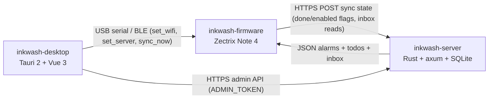

# Inkwash — e-ink calendar, alarms & todos for the Zectrix Note 4

An **offline-first calendar / alarm / todo / notification** device built for the
[**Zectrix Note 4**](https://zectrix.com) — a 4.2″ 400×300 e-paper ESP32-S3
notebook. The firmware is Rust on esp-idf; the companion server and PC tool live
in sibling repositories.

[](LICENSE)
[](#hardware-target)
[-orange.svg)](rust-firmware/rust-toolchain.toml)

## What it is

Content (alarms, todos, inbox) lives on the server and is pulled as structured
JSON over Wi-Fi, but nothing user-visible depends on the network: alarms are
stored in NVS, programmed into the PCF8563 hardware alarm, and rung — with tone —
with no server and no Wi-Fi.

- **Home** — clock, next-alarm countdown, open-todo stats, unread-inbox badge, battery and charge state.
- **Calendar** — month grid with due-day dots; ENTER opens the per-week detail list.
- **Alarms** — daily / weekly (day set) / monthly (day-of-month set) / one-shot, rung offline by the RTC hardware alarm.
- **Todos** — importance (low/med/high), due dates, repeat schedules, and one-shot reminders for high-priority items.
- **Inbox** — notifications pushed from webhooks, agents and CI through the server: browse, open, mark read, unread badge on Home, and a full-screen ringing reminder for `alert` items.
- **Settings** — Sync Now, sync interval, BLE pairing, About (firmware version and git revision).
- **GO TO** — a left-hand navigation overlay shared by every screen.
- **Config** — Wi-Fi, server URL/token, timezone and RTC time are pushed over USB serial/JTAG or BLE; there is no on-device text entry.

## Architecture

The device never authors content; the PC tool only pushes configuration, and the
device pulls content from the server.



Inside this repository the firmware is split into two crates:

| Crate | Path | Role |
|---|---|---|
| `inkwash-note4` | `rust-firmware/` | The ESP32-S3 binary: board bring-up, EPD driver FFI, RTC/I2C, Wi-Fi/BLE, NVS persistence, tones, and the hardware executors for every effect the core asks for. |
| `inkwash-logic` | `logic/` | Host-testable core: the application state machine (events → effects), screens, sync scheduling and validation, alarm rules, power-state decisions, boot guard. No ESP-IDF dependency, so it builds and tests with plain `cargo test`. |

The core drives the device: `inkwash_logic::runtime::Runtime` consumes events and
emits effects, `rust-firmware/src/app_runner.rs` implements the effect executor
against real hardware, and `logic/` tests drive the same state machine through a
scripted harness with recorded effect logs and injected failures. The sibling
server consumes `inkwash-logic` as a git-pinned dependency, so the wire and
validation rules stay shared between the two sides.

## Hardware target

| Part | Detail |
|---|---|
| Board | ESP32-S3-WROOM-1 N16R8 — 16 MB flash (DIO, 80 MHz), 8 MB octal PSRAM |
| Display | 4.2″ 400×300 1-bpp SSD2683 e-paper, driven by `rust-firmware/components/zectrix_epd` over SPI |
| RTC | PCF8563 over I2C — hardware alarm, wake source, low-voltage flag |
| Audio | ES8311 codec + I2S path for the alarm tone, urgent siren and todo beep |
| Keys | ENTER (GPIO0), UP (GPIO39), DOWN (GPIO18) |
| NFC | GT23SC6699 over I2C (optional; boot logs a warning when absent) |

Storage layout (`rust-firmware/partitions.csv`): 64 KiB NVS, PHY init, encrypted
`nvs_keys`, a single 4 MiB `factory` application partition, and a 512 KiB
coredump partition.

Flashing rules:

- This repo targets the **Zectrix Note 4 only**. The Note 4 and Note 4C have different panels and waveforms — never flash one image onto the other.
- Identify the board before every flash (`esptool.py --chip esp32s3 --port <port> read_mac`); a serial-port name such as `/dev/ttyACM0` is not evidence of identity.
- Flash it as ESP32-S3 with 16 MB flash, DIO mode, 80 MHz, and this repo's `partitions.csv`. Never QIO.
- Take a full 16 MB flash backup first (`scripts/backup-flash.ps1` performs the identity check before reading), and restore a unit only from its own backup.
- Never call `esp_wifi_stop()` or `esp_restart()`; restarts go through the deep-sleep path.

## Quick start

Prerequisites: ESP-IDF 5.5.5, the `esp` Xtensa Rust toolchain (`espup install`),
and `espflash`.

```bash
./scripts/build-rust.sh --release
```

The build script locates ESP-IDF (`$IDF_PATH` or the conventional install
locations), sources `export.sh`, points `LIBCLANG_PATH` at the clang shipped with
the `esp` toolchain, and rebuilds from scratch when `partitions.csv` changes. The
output binary is
`rust-firmware/target/xtensa-esp32s3-espidf/release/inkwash-note4`.

Flash it through the identity-checked wrapper, which refuses any port that
is not an ESP32-S3 with 16 MB flash and the authorized Note 4 MAC
(`INKWASH_NOTE4_MAC`), then flashes 16 MB DIO 80 MHz with `partitions.csv`:

```bash
INKWASH_NOTE4_MAC=aa:bb:cc:dd:ee:ff ./scripts/flash-note4.sh --port /dev/ttyACM0
```

`cargo run --release` in `rust-firmware/` uses the same wrapper as its
runner; set `INKWASH_NOTE4_PORT` to the board's port.

A device with no Wi-Fi/server credentials in NVS boots straight to the home
screen; provision it from the desktop tool over USB or BLE (`set_wifi`,
`set_server`), then `sync_now`.

## Build profiles

| Profile | Command | Output | Contents |
|---|---|---|---|
| production (default) | `./scripts/build-rust.sh --release` | `rust-firmware/target/` | The normal firmware. |
| diagnostic | `./scripts/build-rust.sh --diagnostic --release` | `rust-firmware/target-diagnostic/` | Adds `sdkconfig.diagnostic.defaults` (comprehensive heap poisoning, INFO logging) for on-device fault hunting. |
| secure | `INKWASH_SECURE_BOOT_SIGNING_KEY=key.pem ./scripts/build-secure.sh` | `rust-firmware/target-secure/` | Secure Boot V2 + AES-256 flash encryption in release mode + NVS encryption, with JTAG and basic ROM download disabled. |

The production profile, and every GitHub Release built from it, is a
developer build: Secure Boot, flash encryption and NVS encryption are off.
Anyone with physical access to a device can read its Wi-Fi password and
server token from flash and can replace its firmware. Give each device its own
server token and revoke it if the device is lost. The coredump partition holds
task stacks only (`CONFIG_ESP_COREDUMP_CAPTURE_DRAM` is off, and
`release.sh` refuses a build that enables it), so a crash dump does not copy
those secrets out of the heap. The secure profile burns one-way eFuses on first
boot and binds the device to your signing key; flash it only onto a device you
have decided to lock.

## Repository layout

```text
inkwash-firmware/
├── rust-firmware/     # inkwash-note4: src/, components/ (EPD driver, P0-6 recorder),
│                      # assets/ (CJK font blobs), partitions.csv, sdkconfig*.defaults
├── logic/             # inkwash-logic: host-testable core (CI: test + fmt + clippy)
├── scripts/           # build, secure build, backup, smoke test, ledger/git-rev gates, release
├── tools/             # UI preview renderer, CJK font generator, exception-record decoder
├── vendor/            # patched esp-idf-hal, wired in through [patch.crates-io]
├── backups/           # local device flash dumps and manifests (gitignored)
└── LICENSE            # Apache-2.0
```

## Tooling

`scripts/`:

| Script | Purpose |
|---|---|
| `build-rust.sh` | Locate ESP-IDF and build; `--diagnostic` selects the diagnostic profile. |
| `build-rust.ps1` | Windows equivalent of the above. |
| `build-secure.sh` | Secure-profile build; requires an existing Secure Boot V2 signing key. |
| `check-boot-ledger.sh` | Converts the ELF with the same converters used to flash and fails if a loadable segment overlaps the `.rtc_noinit` boot ledger; `--self-test` validates the gate itself. |
| `check-git-rev.sh` | Fails when the ELF's boot banner revision differs from `git describe --always --dirty --tags`. |
| `smoke-note4.py` | Drives the device over the USB `>>IW ` protocol: soak, command stress, reply-timeout checks. |
| `capture-serial.py` | Timestamped serial capture that reconnects across USB re-enumeration, with required-pattern assertions. |
| `flash-note4.sh` | Identity-checked flashing (chip, 16 MB flash, MAC); also the cargo runner. |
| `backup-flash.ps1` | Identity-checked full 16 MB flash backup plus a manifest. |
| `release.sh` | Builds, verifies the partition table and boot ledger, tags, and publishes a GitHub Release with `gh`. |
| `rust-analyzer-cargo.sh` | Wrapper that gives rust-analyzer an ESP-IDF environment. |

`tools/`:

| Tool | Purpose |
|---|---|
| `preview/` | Renders the device screens to PNG on the host by compiling the firmware's real render, canvas, font and icon modules in place: home variants, GO TO, calendar, week view, alarms, todos, inbox, item detail, urgent and alarm-ring screens. |
| `generate_cjk_font.py` | Regenerates `hzk16.bin`, `hzk12.bin` and `cjk_index.bin` (GB2312 94×94 grid) from a system CJK font. |
| `p06_accept.py` | Host-side decoder for P0-6 first-exception records: checks the struct layout with host `cc` offsets and decodes fixed byte samples (complete / bad magic / bad nonce / unfinished claim / wrong core / field mismatch). |

## Device protocols

### Control — USB serial/JTAG and BLE

- **USB** — newline-delimited JSON on the USB Serial/JTAG console: requests carry the `>>IW ` prefix, replies the `<<IW ` prefix.
- **BLE** — NimBLE GATT peripheral, started from the pairing screen and torn down on exit; service `d2c25e50-5e22-48d8-a8b3-34f2f8e2c7d4`, write characteristic `d2c25e51-5e22-48d8-a8b3-34f2f8e2c7d4`, notify characteristic `d2c25e52-5e22-48d8-a8b3-34f2f8e2c7d4`.
- **Commands**, identical on both transports: `set_wifi`, `set_server`, `sync_now`, `set_rtc`, `get_status`, `clear_alarms`, `set_timezone`.
- **Replies**: `ok`, `busy` (not executed, safe to retry), `pending` (accepted, reply follows), `status` (Wi-Fi/server/timezone facts, no secrets), `error`.

Definitions and the session rules live in `logic/src/protocol.rs`,
`logic/src/command_sessions.rs` and `rust-firmware/src/ble_control.rs`.

### Sync

- The device POSTs its *locally changed* state to the configured server URL: `alarms[{id, enabled}]`, `todos[{id, done}]` and `inbox_read[]`. Server-side edits therefore survive the next round-trip instead of being clobbered.
- The server answers with the authoritative `alarms[]`, `todos[]`, `inbox[]`, `inbox_read_acked[]` and `inbox_truncated`. The device deduplicates and range-validates the payload before applying it, and recovers an interrupted apply from a journal.
- Urgent poll: a POST carrying `x-inkwash-poll: 1` returns the urgent flag, so the device learns about a high-priority inbox item without a full sync.
- Timing: urgent polls land on wall-clock :00/:30 boundaries, full syncs on interval boundaries (top of the hour for 60 min, :05 marks for 5 min, …), driven by the RTC; the PCF8563 is realigned over NTP once a day so the boundaries never drift.

## Status

Implemented and host-tested — `inkwash-logic` runs 446 tests covering the screen
state machine, effect scheduling, alarm rules, sync validation and journaled
apply, command sessions, power-state decisions and the boot guard.

Hardware evidence is still outstanding for idle power and response latency, the
full alarm-ringing flow, and BLE pairing end-to-end; device behaviour is verified
by the flash-and-monitor loop, not by the host test suite. The latest tagged
release is **v0.6.0**; `main` is ahead of that tag — see
[`CHANGELOG.md`](CHANGELOG.md) for release scope and known limitations.

## License

[Apache-2.0](LICENSE). Includes the TRMNL16 proportional font (SIL Open Font
License 1.1), the Noto Sans SC CJK font (SIL Open Font License 1.1 — see
`rust-firmware/assets/FONT_LICENSE.txt`), and code ported from the official
`itopinion/zectrix-note4-epd-demo` (MIT) — see the `font8x16.rs` header for
details.
